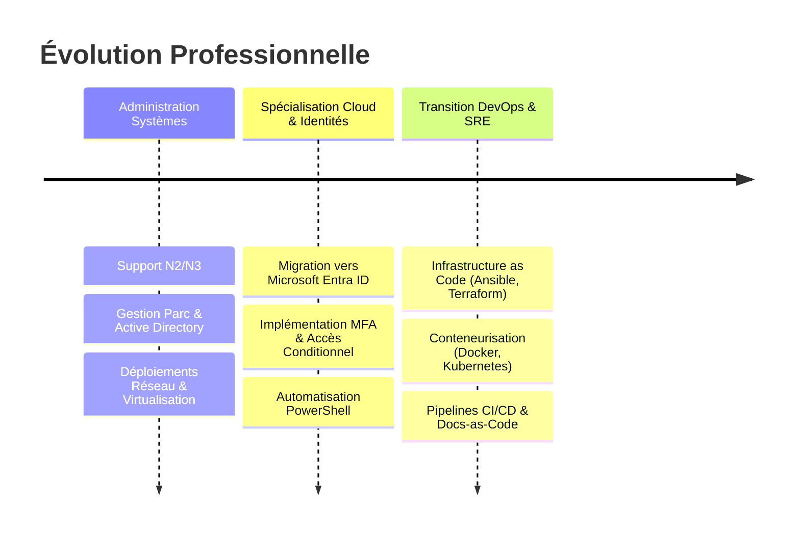

# Profil Professionnel

### Ingénieur Systèmes & Transition DevOps
Passionné par la résilience des infrastructures, l'automatisation et la culture Docs-as-Code. Mon objectif est d'unifier la rigueur de l'administration système traditionnelle avec la vélocité et l'agilité des pratiques DevOps modernes.

[:octicons-mark-github-16: GitHub (chrskrgb)](https://github.com/chrskrgb){ .md-button .md-button--secondary target="_blank" }
[:material-linkedin: LinkedIn](https://linkedin.com/){ .md-button .md-button--secondary target="_blank" }
[:octicons-mail-24: Me Contacter](mailto:votre-email@example.com){ .md-button .md-button--primary }

---

## :material-wrench-clock: Compétences Clés

=== "Cloud & Conteneurs"
    - **Conteneurs** : Docker, Docker Compose, Podman
    - **Orchestration** : Kubernetes (K8s, k3s, Minikube)
    - **CI/CD** : GitHub Actions, GitLab CI
    - **Cloud** : Microsoft Azure, AWS

=== "Systèmes & Annuaire"
    - **Microsoft 365 / Cloud** : Microsoft Entra ID (Azure AD), Intune, Exchange Online
    - **On-Premises** : Windows Server (2019/2022), Active Directory DS, GPO, DNS, DHCP
    - **Linux** : Debian, Ubuntu Server, Red Hat / Rocky Linux
    - **Virtualisation** : VMware vSphere / ESXi, Proxmox VE, Hyper-V

=== "Automatisation & Scripting"
    - **PowerShell** : Modules Microsoft Graph, automatisation de tâches d'administration et rapports
    - **Bash & Shell** : Scripts d'automatisation Linux, maintenance et monitoring
    - **Ansible** : Playbooks, rôles, déploiement d'infrastructures reproductibles
    - **Infrastructure as Code** : Terraform (notions & déploiements de base)

=== "Sécurité & Réseaux"
    - **Identité & Accès** : Zero Trust, Accès Conditionnel, PIM (Privileged Identity Management), MFA
    - **Réseau** : VLANs, routage, VPN (WireGuard, OpenVPN, IPsec)
    - **Pare-feu** : pfSense, Fortinet, Stormshield, iptables/nftables

---

## :material-history: Parcours & Évolution

---

## :material-certificate: Certifications & Formations

- :material-check-decagram: **Microsoft Certified: Azure Fundamentals (AZ-900)** *(ou vos certifications réelles)*
- :material-check-decagram: **Titre Professionnel Administrateur Systèmes & Réseaux**
- :material-school: **Veille continue** : CKA (Certified Kubernetes Administrator) en cours de préparation.

---

!!! info "Personnalisation de cette page"
    Vous pouvez éditer ce fichier [`docs/a-propos.md`](a-propos.md) pour y intégrer directement vos expériences professionnelles réelles, vos liens sociaux et votre CV téléchargeable au format PDF.
