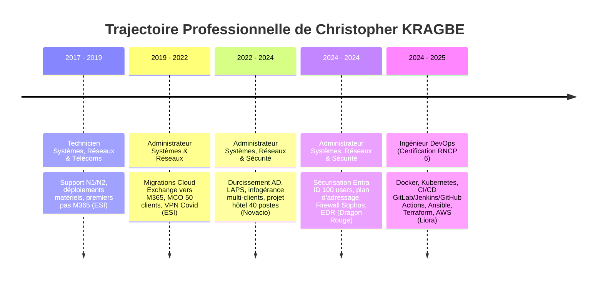

# Profil Professionnel & Parcours

# Christopher KRAGBE

<strong>Administrateur Systèmes, Réseaux & Sécurité $|$ Ingénieur DevOps</strong> 
:material-map-marker: Pantin, France &bull; :material-phone: +33 6 80 81 03 01 &bull; :material-email: <a href="mailto:kragbe.christopher@pm.me">kragbe.christopher@pm.me</a>

[:material-file-pdf-box: Télécharger mon CV au format PDF](assets/Christopher_KRAGBE_CV.pdf){ .md-button .md-button--primary target="_blank" }
[:octicons-mark-github-16: Profil GitHub](https://github.com/chrskrgb){ .md-button .md-button--secondary target="_blank" }
[:material-linkedin: Profil LinkedIn](https://linkedin.com/in/chrs-krgb){ .md-button .md-button--secondary target="_blank" }
[:octicons-mail-24: M'envoyer un email](mailto:kragbe.christopher@pm.me){ .md-button .md-button--secondary }

---

## :material-bullseye-arrow: Synthèse du Profil

> « Administrateur d'infrastructures hybrides (On-premise et Cloud) avec **plus de 5 ans d'expérience opérationnelle**, sur les systèmes traditionnels (Windows/macOS/Linux), le réseau et la sécurité.  
> Récemment certifié **Ingénieur DevOps**, mon objectif actuel est de consolider et d'éprouver sur le terrain mes acquis en automatisation, en intégration continue (CI/CD) et Cloud, afin de faire le pont entre l'exploitation classique et les méthodes d'industrialisation modernes. »

### :material-chart-box-outline: Chiffres & Impacts Clés

-   :material-calendar-clock:{ .lg .middle } __+5 Années d'Expérience__

    ---

    Administration d'environnements de production, gestion d'infrastructures multi-clients et support N1 à N3.

-   :material-shield-check:{ .lg .middle } __100 Utilisateurs Sécurisés__

    ---

    Déploiement MFA obligatoire, Accès Conditionnel Entra ID et filtrage périmétrique avancé chez Dragon Rouge.

-   :material-server-network:{ .lg .middle } __50+ Clients Infogérés__

    ---

    Supervision centralisée via NinjaRMM, patch management et maintien en conditions opérationnelles (MCO).

-   :material-school-outline:{ .lg .middle } __Double Titre RNCP Niveau 6__

    ---

    Ingénieur DevOps (Liora / ex Data Scientest) et Administrateur Systèmes, Réseaux et Sécurité (IPREC).

---

## :material-timeline-text-outline: Chronologie & Évolution Professionnelle

---

## :material-wrench-clock: Compétences Techniques Détaillées

=== "Administration Systèmes & Identités"
    - **Microsoft Entra ID (Azure AD)** : Gestion des identités cloud, synchronisation hybride (Entra Connect / Cloud Sync), groupes dynamiques, rôles administratifs, PIM.
    - **Microsoft 365** : Exchange Online, SharePoint Online, OneDrive for Business, Teams, gouvernance des données.
    - **Active Directory DS** : Architecture de domaine, stratégies de groupe (GPO), unités d'organisation (OU), délégations de privilèges, transfert de rôles FSMO, LAPS.
    - **Gestion des Postes & Terminaux** : Microsoft Intune (MDM / MAM), déploiement BYOD, préparation automatisée de postes.
    - **RMM & Exploitation** : NinjaRMM (télédistribution de scripts, patch management), Deskpro.

=== "Cloud, Conteneurs & DevOps"
    - **Cloud** : Architecture Amazon Web Services (AWS), Microsoft Azure.
    - **Conteneurs** : Docker, Docker Compose, Podman (création d'images durcies et légères multi-stage).
    - **Orchestration** : Kubernetes (Pods, Deployments, Services, ConfigMaps, Ingress).
    - **Infrastructure as Code (IaC)** : Ansible (Playbooks, Roles, Inventory, Ansible Vault), Terraform.
    - **Intégration & Déploiement Continu** : GitHub Actions, GitLab CI, Jenkins.
    - **Supervision & Métrologie** : Prometheus, Grafana.

=== "Infrastructures, Réseaux & Systèmes"
    - **Systèmes d'exploitation** : Windows Server (2012 R2, 2016, 2019, 2022), Linux (Debian, Ubuntu Server, RHEL / Rocky Linux), macOS.
    - **Virtualisation & Stockage** : VMware vSphere / vCenter / ESXi, Microsoft Hyper-V, Proxmox VE, NAS / SAN (Synology, QNAP).
    - **Sauvegardes & PRA/PCA** : Veeam Backup & Replication, Acronis Cyber Protect.
    - **Réseaux & Protocoles** : TCP/IP, DNS, DHCP, VLANs (802.1Q), routage inter-VLAN, NAT/PAT, VPN (WireGuard, OpenVPN, IPsec).

=== "Sécurité, Gouvernance & Normes"
    - **Gestion des Accès** : Authentification Multi-Facteurs (MFA), Stratégies d'Accès Conditionnel, comptes de secours Break-Glass.
    - **Protection Périmétrique & Endpoint** : Firewalls (Sophos, Fortinet, Watchguard), inspection SSL, IPS/IDS, Defender for Office 365, EDR.
    - **Durcissement & Conformité** : Hardening OS (Linux/Windows), sécurisation du protocole Kerberos, conformité RGPD, ISO 27001, bonnes pratiques ITIL.

---

## :material-briefcase-outline: Expériences Professionnelles Détaillées

### :material-domain: **Dragon Rouge** — Paris, France
**Administrateur Systèmes, Réseaux et Sécurité** &bull; *Mai 2024 – Novembre 2024*

- **Sécurisation des identités Cloud** : Sécurisé les accès de 100 utilisateurs (site de Paris) via le déploiement de l'authentification multifacteur (MFA) et de politiques d'accès conditionnel strictes sous Entra ID.
- **Refonte Réseau** : Restructuré le plan d'adressage IP en migrant les services DHCP/DNS pour isoler les réseaux Wi-Fi invités, Wi-Fi collaborateurs et réseaux filaires.
- **Automatisation Postes** : Développé des scripts d'installation et de configuration automatisée pour les postes de travail.
- **Sécurité périmétrique & Endpoint** : Déployé une solution EDR sur l'ensemble des postes macOS et intégré un pare-feu Sophos de dernière génération (règles de filtrage, inspection SSL, prévention d'intrusion IPS) en remplacement d'un équipement défaillant.

[:octicons-shield-lock-24: Consulter la fiche technique Entra ID basée sur ce projet](systeme-identite/entra-id-securisation.md){ .md-button .md-button--secondary }

---

### :material-domain: **Novacio** — Issy-les-Moulineaux, France
**Administrateur Systèmes, Réseaux et Sécurité** &bull; *Novembre 2022 – Avril 2024*

- **Maintien en Conditions Opérationnelles (MCO)** : Assuré le MCO d'un parc multi-clients au sein d'une équipe technique (~25 tickets/jour).
- **Automatisation & Outillage** : Développé des scripts d'automatisation en PowerShell et Batch afin d'éliminer les interventions manuelles et répétitives.
- **Audit & Durcissement Active Directory** : Identifié et remédié aux vulnérabilités d'annuaire, renforcé la sécurité du protocole Kerberos et déployé LAPS (*Local Administrator Password Solution*) pour supprimer les mots de passe administrateur locaux identiques.
- **Déploiement d'infrastructure hôtelière** : Conçu et déployé l'infrastructure IT complète pour l'ouverture d'un établissement hôtelier (~40 postes), avec intégration de terminaux mobiles en BYOD dans le tenant Microsoft 365.
- **Gestion des connaissances** : Refondu la base de connaissances documentaire (création de templates standardisés, rédaction de manuels d'exploitation opérationnels).

---

### :material-domain: **ESI (Easy Service Informatique)** — Paris, France
**Administrateur Systèmes et Réseaux** &bull; *Septembre 2019 – Janvier 2022*

- **Migration vers le Cloud M365** : Piloté la transition d'environnements On-Premise vers le Cloud : migration des boîtes aux lettres d'Exchange local vers Microsoft 365, et migration des serveurs de fichiers traditionnels vers SharePoint Online et OneDrive avec adoption de Microsoft Teams.
- **Modernisation du parc serveurs** : Montée de version de contrôleurs de domaine Windows Server 2012 R2 vers Windows Server 2022 avec transfert sécurisé des rôles FSMO.
- **Sauvegardes & Continuité d'activité** : Administration et tests de restauration réguliers des sauvegardes hybrides via Veeam Backup et Acronis.
- **Infogérance & RMM** : Supervision proactive du parc d'une cinquantaine d'entreprises clientes via l'outil NinjaRMM (Patch Management automatisé, exécution de scripts distants) et support technique N1 à N3 sous Deskpro.
- **Continuité d'activité Covid-19** : Déploiement d'urgence de passerelles VPN avec authentification renforcée et politiques de filtrage strictes sur pare-feu Sophos pour permettre le travail à distance massif.

**Technicien Systèmes et Réseaux** &bull; *Septembre 2018 – Septembre 2019*

- Support utilisateur Niveaux 1 et 2 en environnement multi-clients.
- Préparation matérielle, masterisation et intégration en réseau (postes clients, serveurs, stockages NAS).
- Gestion quotidienne des tenants Microsoft 365 (création des comptes, gestion des licences et groupes de sécurité).

---

## :material-school-outline: Formations & Certifications

-   :material-certificate:{ .lg .middle } __Ingénieur DevOps__

    ---

    **Liora (ex Data Scientest)** &bull; *Nov. 2024 – Déc. 2025*  
    **Titre RNCP Niveau 6 (Bac+3/4)**  
    *Cloud AWS, Conteneurisation Docker, Orchestration Kubernetes, CI/CD (GitLab, Jenkins), Infrastructure as Code (Ansible, Terraform), Monitoring (Prometheus, Grafana).*

-   :material-certificate:{ .lg .middle } __Administrateur Systèmes, Réseaux et Sécurité__

    ---

    **IPREC** &bull; *Juin 2022 – Oct. 2022*  
    **Titre RNCP Niveau 6 (Bac+3/4)**  
    *Administration avancée Windows/Linux, virtualisation, politiques de sécurité, routage et pare-feu.*

-   :material-school:{ .lg .middle } __Technicien Supérieur Réseaux & Télécoms__

    ---

    **Centre Laser Formation** &bull; *Sept. 2018 – Juin 2019*  
    **Titre RNCP Niveau 5 (Bac+2)**  
    *Architecture réseaux LAN/WAN, protocoles de communication, services d'annuaire et maintenance.*

-   :material-school:{ .lg .middle } __Technicien Systèmes, Réseaux & Télécoms__

    ---

    **Centre Laser Formation** &bull; *Sept. 2017 – Juin 2018*  
    **Titre RNCP Niveau 4 (Bac)**  
    *Support technique, maintenance préventive et curative, câblage et configuration des équipements.*

---

## :material-translate: Langues & Engagement Associatif

- **Langues** :
    - :fr: **Français** : Langue maternelle
    - :gb: **Anglais** : Professionnel et technique (Niveau B2) — apte à rédiger et échanger en contexte international.
- **Engagement bénévole** :
    - **Coordinateur Polyvalent** &bull; *L'Esprit Léger* (Juin 2018 – Présent)  
      Conception technique, régie, logistique, production et animation d'événements culturels et festifs à Montreuil.
