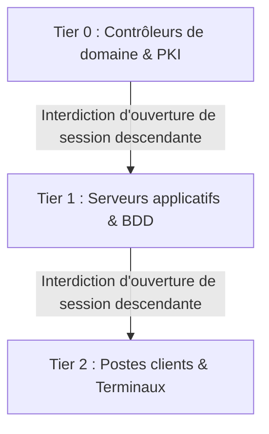

# Active Directory & Hybridation

L'Active Directory local constitue souvent le point central de l'authentification d'entreprise. Cette documentation expose les bonnes pratiques d'architecture et de synchronisation vers le Cloud Microsoft.

---

## 1. Modèle d'administration en niveaux (Tiering Model)

Afin d'éviter les mouvements latéraux d'attaquants, le principe de séparation des privilèges est appliqué :

- **Tier 0 (Contrôle d'accès & Identités)** : Contrôleurs de domaine, PKI d'entreprise, serveurs Entra Connect.
- **Tier 1 (Serveurs & Applications)** : Serveurs de fichiers, bases de données, hyperviseurs.
- **Tier 2 (Postes de travail)** : Stations de travail utilisateurs et périphériques.

---

## 2. Synchronisation Hybride Entra Connect

- Déploiement d'**Entra Connect Cloud Sync** pour un modèle agent léger.
- Filtrage des unités d'organisation (OU) pour ne synchroniser que les comptes nécessaires.
- Activation de la protection contre les suppressions accidentelles (*Accidental Deletion Prevention*).

!!! tip "Conseil de sécurité"
    Ne jamais utiliser un compte Administrateur du domaine local pour administrer Entra ID. Privilégier des comptes nominatifs distincts pour les tâches Cloud.
