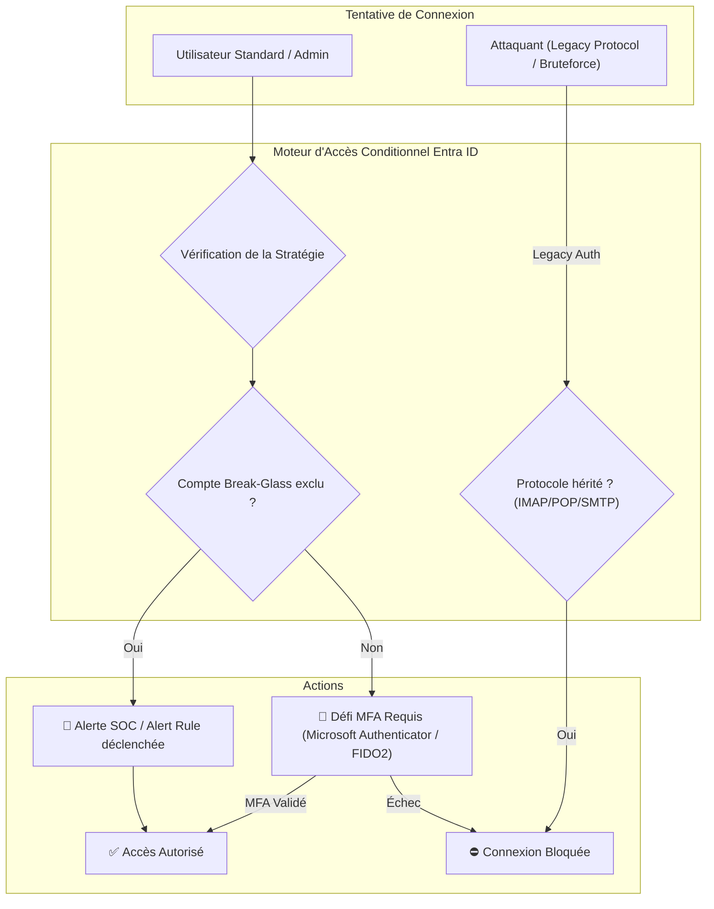

# Sécurisation d'Accès sous Microsoft Entra ID (Azure AD)

Cette procédure technique détaille les étapes méthodologiques et opérationnelles pour durcir l'accès à un tenant **Microsoft Entra ID**. Elle couvre la création de comptes d'urgence (*Break-Glass*), l'éradication des protocoles d'authentification obsolètes et le déploiement d'une stratégie d'**Accès Conditionnel** imposant le MFA.

!!! info "Cas pratique d'entreprise (retour d'expérience)"
    Cette documentation formalise l'architecture et les étapes appliquées lors de la sécurisation des accès de **100 utilisateurs** pour l'agence **Dragon Rouge** (Paris).

---

## :material-target: Objectifs & Schéma d'Architecture



---

## 1. Prérequis & Comptes d'Urgence (*Break-Glass*)

Avant d'appliquer toute politique d'accès conditionnel stricte, il est impératif d'isoler au minimum **deux comptes d'accès d'urgence** afin d'éviter tout verrouillage accidentel (*lockout*) de l'organisation.

### Caractéristiques d'un compte Break-Glass

- **Cloud-Only** : Créé nativement dans Entra ID (`*.onmicrosoft.com`), sans synchronisation depuis l'Active Directory local.
- **Rôle** : Administrateur Général (*Global Administrator*) attribué de manière permanente.
- **Exclusion** : Exclu explicitement de **toutes** les règles d'Accès Conditionnel.
- **Sécurité** : Mot de passe complexe (> 30 caractères, stocké dans un coffre-fort physique scellé), MFA matériel FIDO2 dédié si applicable.

```powershell title="Création d'un compte d'urgence via Microsoft Graph PowerShell"
# Connexion au tenant avec privilèges administratifs
Connect-MgGraph -Scopes "User.ReadWrite.All", "RoleManagement.ReadWrite.Directory"

# Paramètres du compte d'urgence
$PasswordProfile = @{
    ForceChangePasswordNextSignIn = $false
    Password = (New-Guid).ToString() + "!SecureP@ss2026#"
}

# Création de l'utilisateur Break-Glass
$EmergencyUser = New-MgUser -DisplayName "EMERGENCY-ADMIN-01" `
    -UserPrincipalName "breakglass01@votreorganisation.onmicrosoft.com" `
    -AccountEnabled $true `
    -MailNickName "breakglass01" `
    -PasswordProfile $PasswordProfile

# Attribution du rôle Global Administrator
$RoleDef = Get-MgRoleManagementDirectoryRoleDefinition -Filter "DisplayName eq 'Global Administrator'"
New-MgRoleManagementDirectoryRoleAssignment -PrincipalId $EmergencyUser.Id `
    -RoleDefinitionId $RoleDef.Id `
    -DirectoryScopeId "/"
```

!!! danger "Attention au verrouillage global"
    Ne déployez **jamais** de stratégie d'accès conditionnel ciblant "Tous les utilisateurs" sans avoir préalablement ajouté l'exclusion de vos comptes Break-Glass.

---

## 2. Blocage des Authentifications Héritées (*Legacy Auth*)

Les protocoles d'authentification standard (POP3, IMAP4, SMTP Auth, MAPI hérité) ne supportent pas les défis d'authentification moderne et permettent de contourner le MFA.

### Création de la règle de blocage

1. Naviguez dans **Microsoft Entra admin center** > **Protection** > **Accès conditionnel**.
2. Créez une nouvelle stratégie : `[SEC-01] Bloquer l'authentification héritée`.
3. Configurez les sections suivantes :
    - **Utilisateurs** : *Tous les utilisateurs*, avec exclusion des comptes *Break-Glass*.
    - **Ressources cibles** : *Toutes les ressources cloud*.
    - **Conditions** > **Applications clientes** : Laisser *Clients d'authentification moderne* décoché, et cocher **Autres clients** et **Clients Exchange ActiveSync**.
    - **Contrôles d'accès (Accorder)** : **Bloquer l'accès**.

```json title="Extrait JSON de la politique conditionnelle (MS Graph API)"
{
  "displayName": "[SEC-01] Bloquer l'authentification héritée",
  "state": "enabledForReportingButNotEnforced",
  "conditions": {
    "users": {
      "includeUsers": ["All"],
      "excludeUsers": ["<ID_COMPTE_BREAKGLASS_1>", "<ID_COMPTE_BREAKGLASS_2>"]
    },
    "applications": { "includeApplications": ["All"] },
    "clientAppTypes": ["exchangeActiveSync", "other"]
  },
  "grantControls": {
    "operator": "OR",
    "builtInControls": ["block"]
  }
}
```

!!! tip "Phase de transition : Mode Rapport Seul"
    Laissez la règle en état `enabledForReportingButNotEnforced` (*Report-only*) pendant au moins 14 jours pour analyser les connexions légitimes impactées via le classeur *Accès conditionnel - Insights et création de rapports*.

---

## 3. Imposition du MFA via l'Accès Conditionnel

Cette stratégie impose l'authentification multifacteur pour toutes les sessions utilisateurs.

### Paramétrage de la stratégie principale

- **Nom** : `[SEC-02] Exiger le MFA pour tous les utilisateurs`
- **Affectations** :
    - **Inclus** : *Tous les utilisateurs*
    - **Exclus** : Comptes d'urgence Break-Glass et comptes de service nominatifs gérés par Workload Identities.
- **Ressources cibles** : *Toutes les applications cloud*.
- **Contrôles d'accès** :
    - Cocher **Accorder l'accès**.
    - Cocher **Exiger une authentification multifacteur**.
    - Cocher **Exiger une force d'authentification** (*Phishing-resistant MFA* pour les administrateurs si disponible).

---

## 4. Vérification, audit & alertes (alerting)

### Requête KQL pour détecter l'usage du compte Break-Glass

Dans Microsoft Sentinel ou Log Analytics (table `SigninLogs`) :

```kql title="Détection KQL de connexion sur compte Break-Glass"
SigninLogs
| where TimeGenerated >= ago(24h)
| where UserPrincipalName in~ ("breakglass01@votreorganisation.onmicrosoft.com", "breakglass02@votreorganisation.onmicrosoft.com")
| project TimeGenerated, UserPrincipalName, IPAddress, Location, AppDisplayName, Status, RiskDetail
| order by TimeGenerated desc
```

!!! note "Alerte de sécurité recommandée"
    Configurez une règle d'alerte Azure Monitor avec notification par SMS/Appel d'urgence vers l'astreinte dès qu'une ligne est renvoyée par cette requête, car ce compte ne doit être utilisé qu'en situation de crise.
